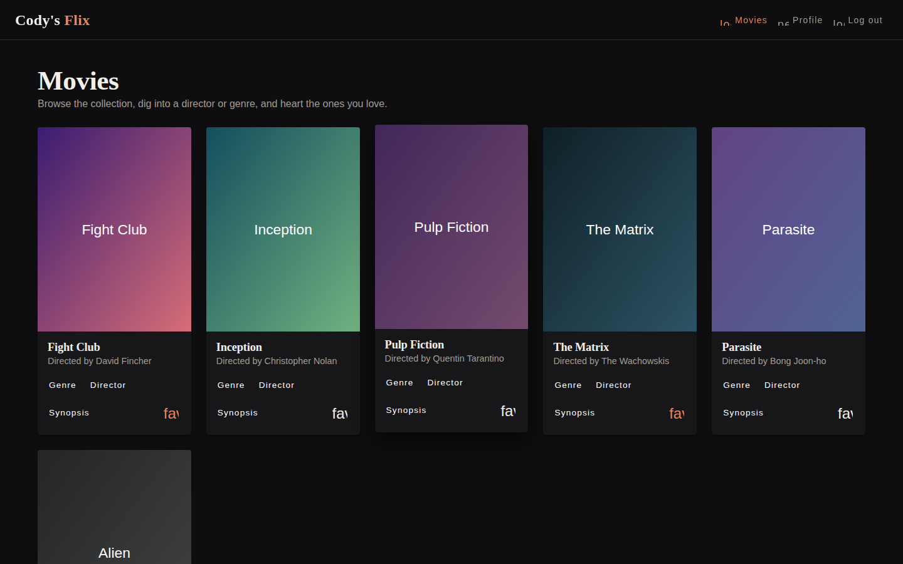

# Cody's Flix — Angular Client

A single-page Angular application for browsing movies, exploring directors and genres, and saving favorites — built on top of the myFlix REST API.

**Live demo:** https://cody-ayers.github.io/myFlix-Angular-client/



---

## Features

- **Welcome page** with sign up and log in dialogs
- **Movie grid** — browse the full collection with poster images, director, genre, and synopsis dialogs
- **Favorites** — heart a movie to save it; unfavorite from any card
- **Profile page** — view your info and favorited movies, update your details, or delete your account
- **Route guard** — `/movies` and `/profile` redirect to `/welcome` if you're not logged in
- **Responsive** — single-column on mobile, auto-fill grid on wider screens

## Tech Stack

| Area | Tools |
|---|---|
| Framework | Angular 15, TypeScript |
| UI components | Angular Material (dark theme, custom rust accent) |
| HTTP | Angular `HttpClient`, bearer-token auth |
| Routing | Angular Router with `CanActivate` guard |
| Deployment | GitHub Pages (built to `docs/`) |
| API | [myFlix REST API](https://codys-flix-0b23a40a1d0d.herokuapp.com/) (Node.js, Express, MongoDB) |

## Running Locally

```bash
git clone https://github.com/Cody-Ayers/myFlix-Angular-client.git
cd myFlix-Angular-client
npm install
ng serve
```

Open http://localhost:4200. Sign up for an account to start browsing.

## Deploying to GitHub Pages

```bash
ng build --output-path docs --base-href /myFlix-Angular-client/
# commit and push — GitHub Pages serves from docs/
```

## Project Structure

```text
src/
├── app/
│   ├── models.ts                        # Movie, User, UserUpdate interfaces
│   ├── auth.guard.ts                    # CanActivate route guard
│   ├── fetch-api-data.service.ts        # All API calls
│   ├── welcome-page/                    # Landing page with login/signup dialogs
│   ├── navigation-bar/                  # Sticky toolbar
│   ├── movie-card/                      # Movie grid page
│   ├── user-profile-component/          # Profile + favorites page
│   ├── user-login-form/                 # Login dialog
│   ├── user-registration-form/          # Sign up dialog
│   ├── director-view-component/         # Director info dialog
│   ├── genre-view-component/            # Genre info dialog
│   └── movie-description-component/     # Synopsis dialog
└── styles.scss                          # Global theme and shared layout
```

## What This Project Demonstrates

- Building a full single-page app with Angular: components, services, routing, dialogs, and forms
- Angular Material theming — a fully custom dark palette with a branded accent color
- HTTP and auth: bearer-token headers, `HttpClient`, centralized API service
- TypeScript interfaces (`Movie`, `User`, `UserUpdate`) for typed API responses
- Route guards (`CanActivate`) to protect authenticated pages
- Reactive patterns with RxJS Observables and `subscribe`
- Responsive layout with CSS Grid (`auto-fill`) and Angular Material breakpoints
- Deployment to GitHub Pages

## Author

**Cody Ayers** · [Portfolio](https://cody-ayers.github.io/PortfolioWebsite/) · [GitHub](https://github.com/Cody-Ayers)
